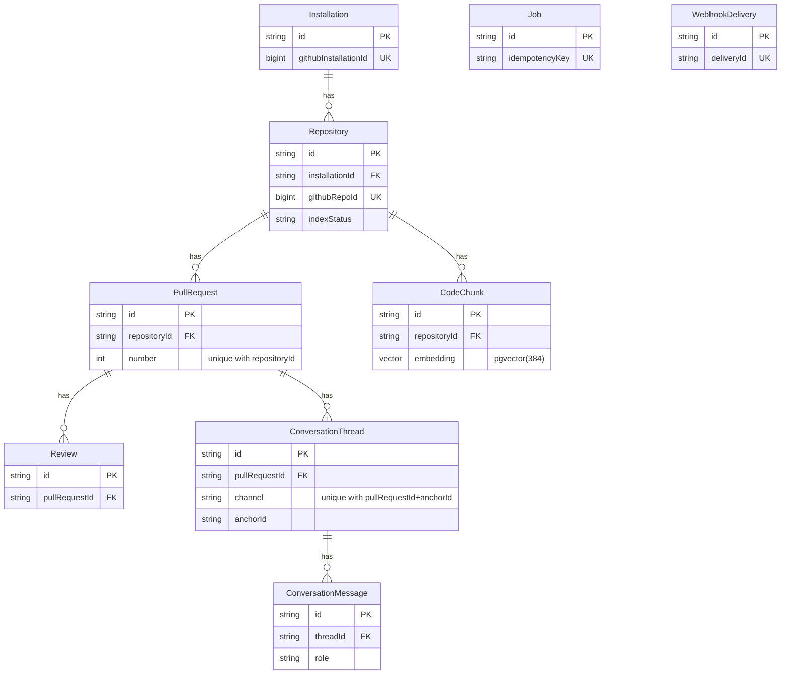

# Database Schema

Postgres (with the `pgvector` extension) is the only datastore. The schema is defined in
[`prisma/schema.prisma`](../prisma/schema.prisma) and applied via the SQL migrations in
`prisma/migrations/`. This document explains what each table is for and how they relate.

## Entity-relationship diagram

All relationships are **one-to-many** (`||--o{`, read "one … has zero or more …"). There are
**no many-to-many** relationships, so there are no join tables.



> `Job` and `WebhookDelivery` have no edges — they are intentionally **standalone** (no foreign
> keys). They are infrastructure, not domain data, and reference domain rows only by id inside a
> JSON payload or by an opaque key.

### Relationships at a glance

| Parent | Child | Cardinality | FK on child | On delete |
|---|---|---|---|---|
| `Installation` | `Repository` | one-to-many | `installationId` | Cascade |
| `Repository` | `PullRequest` | one-to-many | `repositoryId` | Cascade |
| `Repository` | `CodeChunk` | one-to-many | `repositoryId` | Cascade |
| `PullRequest` | `Review` | one-to-many | `pullRequestId` | Cascade |
| `PullRequest` | `ConversationThread` | one-to-many | `pullRequestId` | Cascade |
| `ConversationThread` | `ConversationMessage` | one-to-many | `threadId` | Cascade |
| `Job` | — | none (standalone) | — | — |
| `WebhookDelivery` | — | none (standalone) | — | — |

## Deletion / lifecycle (cascades)

Every domain relation uses `onDelete: Cascade`, forming one chain:

```
delete Installation → its Repositories → their PullRequests → Reviews
                                                            → ConversationThreads → ConversationMessages
                    → CodeChunks (via Repository)
```

Consequences relied on by the app:
- **PR closed/merged** → the app deletes the `PullRequest` row, which cascades away its reviews,
  conversation threads, and messages in one statement (`InstallationsService.deletePullRequest`).
- **App uninstalled / repo removed** → deleting the `Installation`/`Repository` cascades the
  whole subtree, including embeddings.

## Cross-cutting conventions

- **Primary keys** are `cuid()` strings (`id`), generated app-side.
- **GitHub identifiers** (`githubInstallationId`, `githubRepoId`, `githubPrId`,
  `githubReviewId`, `githubCommentId`) are `BigInt` — GitHub ids exceed 32-bit range.
- **Status / role / channel** columns are plain `String` with the allowed values documented in
  an inline comment (kept as strings rather than DB enums for migration-free flexibility).
- **`Json` columns** (`Repository.profile`, `PullRequest.intent`, `Review.findings`,
  `Job.payload`) store structured blobs the app serializes/validates in code.
- **Secrets** (`*ApiKeyEncrypted`) are AES-256-GCM ciphertext, never plaintext (see
  `EncryptionService`).
- **Timestamps**: `createdAt @default(now())`; `updatedAt @updatedAt` where rows mutate.

---

## Tables

### Installation
A GitHub App installation on a user/org account. Holds per-installation provider overrides;
when an override is null the app falls back to the global env config.

| Field | Type | Notes |
|---|---|---|
| `id` | String (cuid) | PK |
| `githubInstallationId` | BigInt **unique** | GitHub's installation id |
| `accountLogin`, `accountType` | String | account the app is installed on |
| `llmProvider`, `llmModel` | String? | chat overrides (e.g. `anthropic`, `openai-compatible`) |
| `llmApiKeyEncrypted` | String? | encrypted chat API key |
| `embeddingBaseUrl`, `embeddingModel` | String? | embedding overrides |
| `embeddingApiKeyEncrypted` | String? | encrypted embedding key |
| `enabled` | Boolean | master on/off |
| `suspendedAt` | DateTime? | set when GitHub suspends the installation |

Relations: `repositories Repository[]`.

### Repository
A repo the app is installed on, plus its cached knowledge state.

| Field | Type | Notes |
|---|---|---|
| `id` | String (cuid) | PK |
| `installationId` | String | FK → Installation (**cascade**) |
| `githubRepoId` | BigInt **unique** | GitHub repo id |
| `owner`, `name`, `fullName` | String | |
| `defaultBranch` | String | default `main` |
| `isPrivate`, `enabled` | Boolean | |
| `indexStatus` | String | `pending` \| `indexing` \| `ready` \| `failed` |
| `indexedSha` | String? | commit the index reflects |
| `indexedAt` | DateTime? | |
| `profile` | Json? | the cached "repo card" (README, manifests, languages, tree) |

Relations: `pullRequests`, `chunks`. Index: `installationId`.

### PullRequest
A PR seen by the app; the hub of per-PR data. Upserted on review and on the first comment.

| Field | Type | Notes |
|---|---|---|
| `id` | String (cuid) | PK |
| `repositoryId` | String | FK → Repository (**cascade**) |
| `number` | Int | PR number; **unique with `repositoryId`** |
| `githubPrId` | BigInt? | |
| `title`, `body`, `state` | String | |
| `headSha`, `baseSha` | String | |
| `intent` | Json? | inferred-intent signals (title/body/issues/commits) |

Relations: `reviews`, `conversations`. Constraint: `@@unique([repositoryId, number])`.

### Review
One posted review (or a failed attempt) for a PR at a specific commit.

| Field | Type | Notes |
|---|---|---|
| `id` | String (cuid) | PK |
| `pullRequestId` | String | FK → PullRequest (**cascade**) |
| `jobId` | String? | the job that produced it |
| `headSha` | String | commit reviewed (used to detect "already reviewed") |
| `status` | String | `pending` \| `completed` \| `failed` |
| `provider`, `model` | String? | which LLM produced it |
| `summary` | String? | top-level summary body |
| `findings` | Json? | full structured LLM output |
| `githubReviewId` | BigInt? | id of the GitHub review created |
| `tokensInput`, `tokensOutput` | Int? | usage/cost accounting |
| `error` | String? | set when `status = failed` |

Index: `pullRequestId`.

### ConversationThread
A conversation channel attached to a PR — either the PR conversation or one inline review thread.

| Field | Type | Notes |
|---|---|---|
| `id` | String (cuid) | PK |
| `pullRequestId` | String | FK → PullRequest (**cascade**) |
| `channel` | String | `issue` (PR conversation) \| `review` (inline thread) |
| `anchorId` | String | review root comment id, or `'pr'` for the conversation |

Relations: `messages`. Constraint: `@@unique([pullRequestId, channel, anchorId])` — one thread per anchor.

### ConversationMessage
One turn in a thread (the user's comment or the bot's reply). Provides the history the model
sees on the next turn.

| Field | Type | Notes |
|---|---|---|
| `id` | String (cuid) | PK |
| `threadId` | String | FK → ConversationThread (**cascade**) |
| `role` | String | `user` \| `assistant` |
| `authorLogin` | String | comment author (or the bot login) |
| `githubCommentId` | BigInt? | the GitHub comment id |
| `body` | String | comment/reply text |

Index: `threadId`.

### CodeChunk
A chunk of repository source with its embedding — the RAG index, queried by cosine similarity.

| Field | Type | Notes |
|---|---|---|
| `id` | String (cuid) | PK |
| `repositoryId` | String | FK → Repository (**cascade**) |
| `filePath` | String | |
| `startLine`, `endLine` | Int | line window the chunk covers |
| `content` | String | chunk text |
| `blobSha` | String | source blob sha (enables future incremental re-index) |
| `embedding` | `vector(384)` | **pgvector**; `Unsupported(...)` in Prisma, read/written via raw SQL |

Indexes: `repositoryId`, `(repositoryId, filePath)`, and an **HNSW** index
`CodeChunk_embedding_hnsw_idx` on `embedding vector_cosine_ops` (added in the migration SQL;
Prisma can't express it, so a regenerated diff must not drop it).

> The `embedding` dimension (`384`) must match `EMBEDDING_DIMENSIONS` and the embedding model
> (`BAAI/bge-small-en-v1.5` = 384). Changing models means changing both the column and the env.

### Job
The Postgres-backed async work queue. Rows are claimed atomically with
`UPDATE … WHERE id IN (SELECT … FOR UPDATE SKIP LOCKED)` so multiple workers never collide.

| Field | Type | Notes |
|---|---|---|
| `id` | String (cuid) | PK |
| `type` | String | `bootstrap_repository` \| `refresh_index` \| `review_pull_request` \| `pr_command` |
| `payload` | Json | type-specific job input |
| `status` | String | `pending` \| `running` \| `completed` \| `failed` (dead-letter) |
| `attempts`, `maxAttempts` | Int | incremented on claim; dead-letters at the cap |
| `runAt` | DateTime | next eligible run (set to future on retry via backoff) |
| `lockedAt`, `lockedBy` | DateTime?/String? | which worker holds the row |
| `lastError` | String? | last failure message |
| `idempotencyKey` | String? **unique** | dedupe key; enqueue is `ON CONFLICT DO NOTHING` |

Index: `(status, runAt)` — the dequeue predicate.

Idempotency key shapes (`IdempotencyService`): `bootstrap:{repoId}`,
`refresh:{repoId}:{sha}`, `review:{repoId}:{pr}:{headSha}`, `command:{commentId}`.

### WebhookDelivery
A log of every processed webhook delivery, so GitHub redeliveries are dropped before any work
is enqueued (the first line of idempotency).

| Field | Type | Notes |
|---|---|---|
| `id` | String (cuid) | PK |
| `deliveryId` | String **unique** | GitHub's `X-GitHub-Delivery` id |
| `event`, `action` | String/String? | for observability |
| `receivedAt` | DateTime | |
